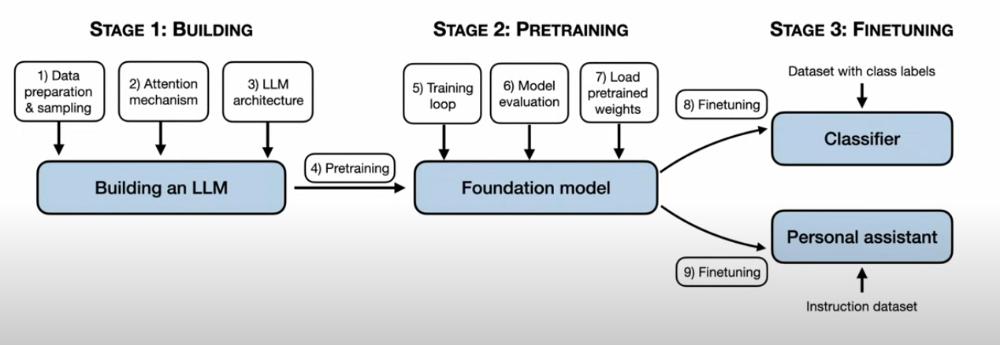

# Chapter 01

This file contains a summary of the two videos from the repository's chapter 01.

## Setting up a Python virtual enviroment

For this course i am using a conda enviroment.

1. Create a conda enviroment and activate it:
```bash
conda create -n llm-env python=3.11
conda activate llm-env
```
2. Install uv package manager:
```bash
pip install uv
```
3. Install requirements:
```bash
uv pip install -r requirements.txt
```

## Basic concepts about LLMs

Developing an LLM model consists in three stages:

